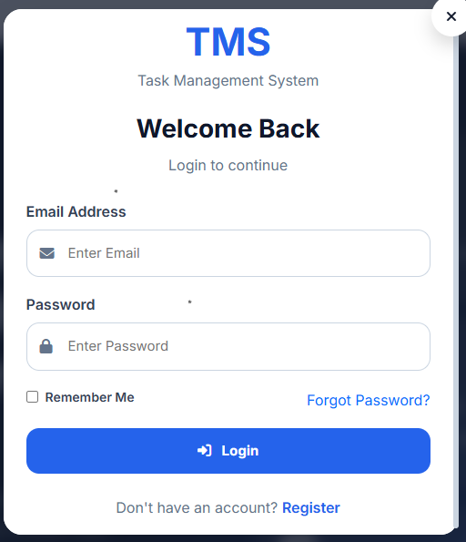
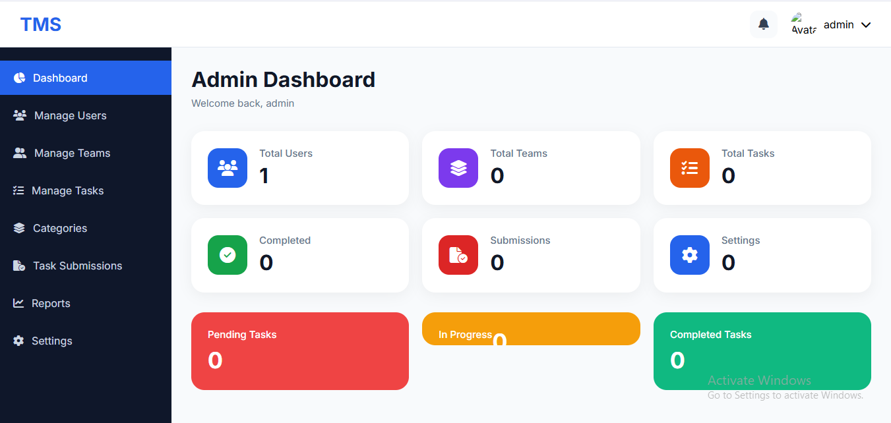
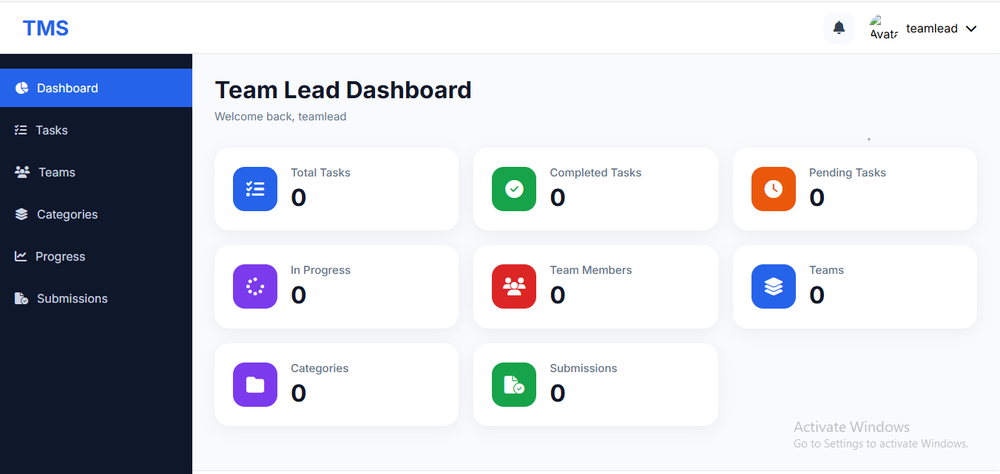
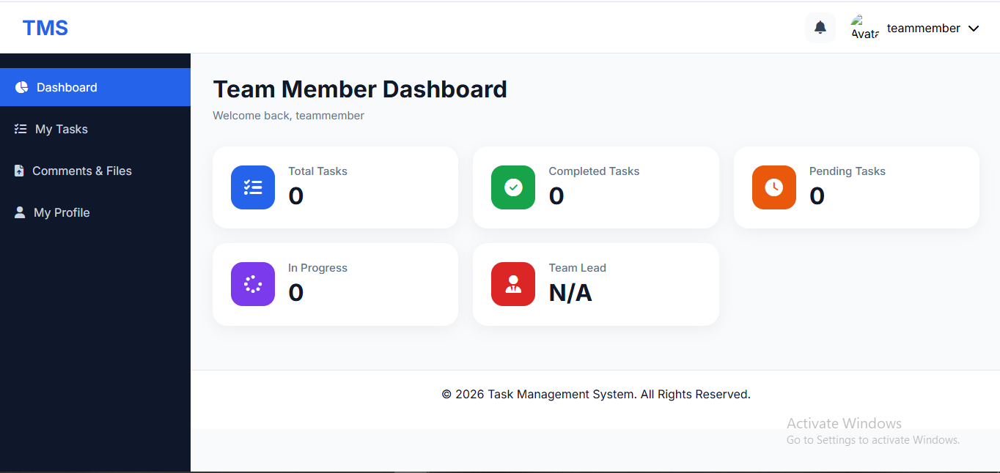
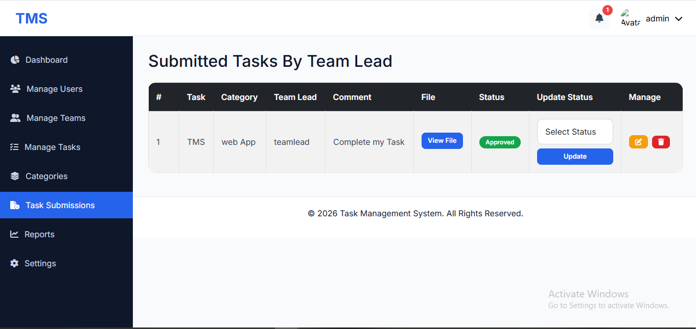

# Task Management System (Laravel 12)

## Description

A role-based Task Management System built with Laravel 12. The application supports Admin, Team Lead, and Team Member roles with complete task lifecycle management.

## Features

* Multi-role Authentication
* Admin Dashboard
* Team Lead Dashboard
* Team Member Dashboard
* Task Assignment System
* Task Status Tracking
* Team Management
* Notifications
* Reports
* Responsive User Interface

## Tech Stack

* Laravel 12
* PHP
* MySQL
* Blade Templates
* JavaScript
* CSS
* Bootstrap

## Installation

```bash
git clone https://github.com/Asmmujahid/laravel-task-management-system.git

cd laravel-task-management-system

composer install

npm install

cp .env.example .env

php artisan key:generate

php artisan migrate

php artisan serve
```

## 📸 Screenshots

### Login Page


### Admin Dashboard


### Team Lead Dashboard


### Team Member Dashboard


### Task Management


## Author

Asma Mujahid
